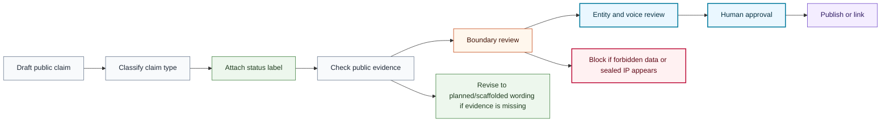

# Claim Review Flow

## Purpose

This graph shows how public technical claims move from draft wording to reviewed status.

## Mermaid Diagram

## Interpretation Notes

- Evidence and boundary review happen before publication.
- Missing evidence does not require deletion when wording can be safely downgraded to planned or scaffolded.
- Human approval remains required for released, deployed, evaluated, service, or impact claims.

## Boundary Notes

- Claims must not expose donor data, student data, volunteer data, customer data, private operations, private telemetry, sealed IP, or security-sensitive NEURONA operational details.
- Foundation claims cannot be used as company marketing proof.

## Follow-Up Actions

- Apply this flow to README, report, profile, and portfolio copy updates.
- Keep claim language synchronized with roadmap status labels.
