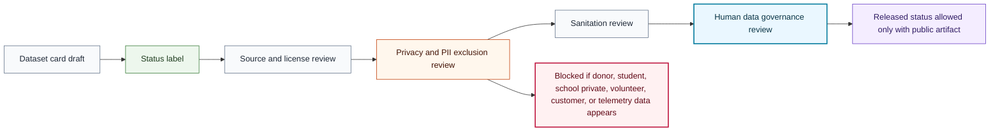

# Dataset Safety Review Flow

## Purpose

This graph shows the public-safe review flow before a dataset card can claim released status.

## Mermaid Diagram

## Interpretation Notes

- Dataset release requires source, privacy, sanitation, and governance review.
- Released status is not allowed for templates or planned datasets.
- Blocked data cannot be transformed into public examples.

## Boundary Notes

- Donor data, student data, school private data, volunteer data, customer data, private telemetry, raw data, and unapproved sanitized samples are excluded.
- The flow does not claim that any dataset exists or has been released.

## Follow-Up Actions

- Reuse this flow in dataset-card companion documentation.
- Add public dataset links only after release approval.
