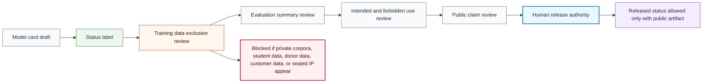

# Model Safety Review Flow

## Purpose

This graph shows the public-safe review flow before a model card can claim released status.

## Mermaid Diagram

## Interpretation Notes

- Released status depends on public artifact evidence and human authority.
- Data exclusion review happens before evaluation and claim wording are publicized.
- Blocked material cannot be summarized into public text.

## Boundary Notes

- Private training corpora, model weights, private evaluations, donor data, student data, customer data, and sealed YOSO-YAi LLC IP are excluded.
- The flow does not claim that any model exists or has been released.

## Follow-Up Actions

- Reuse this flow in model-card companion documentation.
- Add artifact-specific evidence links only after review.
