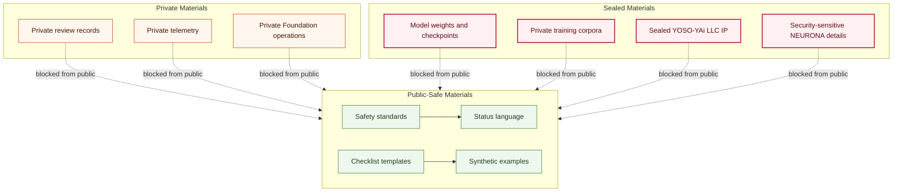

# Public/Private Boundary Map

## Purpose

This graph shows which civic AI safety materials may be public and which must remain private or sealed.

## Mermaid Diagram

## Interpretation Notes

- Public content is limited to standards, templates, synthetic examples, and status language.
- Private and sealed materials cannot be excerpted into public safety notes.
- Mixed artifacts must be split before publication.

## Boundary Notes

- Donor data, student data, volunteer data, customer data, private operations, private telemetry, model weights, private training corpora, and sealed YOSO-YAi LLC IP are forbidden.
- Security-sensitive NEURONA operational details remain sealed or private.

## Follow-Up Actions

- Add path-level boundary rules if public and private artifacts are ever split across repos.
- Keep forbidden-data lists synchronized with release repositories.
