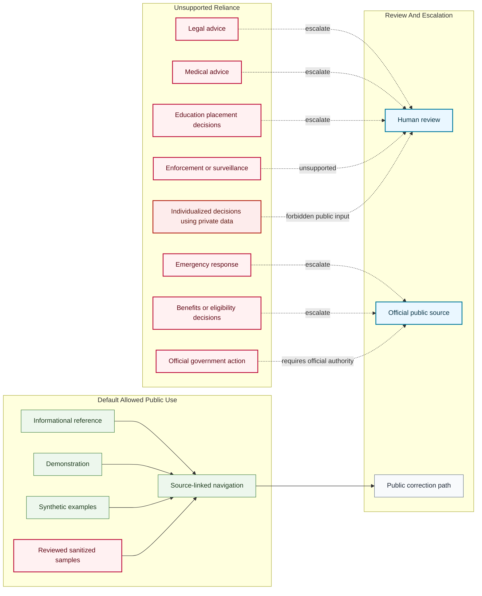

# Public Reliance Boundary Map

## Purpose

This graph shows the default boundary between allowed public informational use and unsupported reliance for civic AI artifacts.

## Mermaid Diagram

## Interpretation Notes

- Default public use is informational or demonstrational.
- High-stakes decisions require official sources or human review.
- Public demos must not accept private data for individualized decisions.

## Boundary Notes

- Emergency, legal, medical, eligibility, education placement, enforcement, and official action use cases are unsupported unless a later reviewed release explicitly changes scope.
- Sanitized public samples require review before publication.
- Private data must not be entered into public demos or examples.

## Follow-Up Actions

- Add this map to Space companion docs when `foundation-spaces` is scaffolded.
- Link artifact-specific safety notes after review.
- Revisit reliance language before any experimental release.
