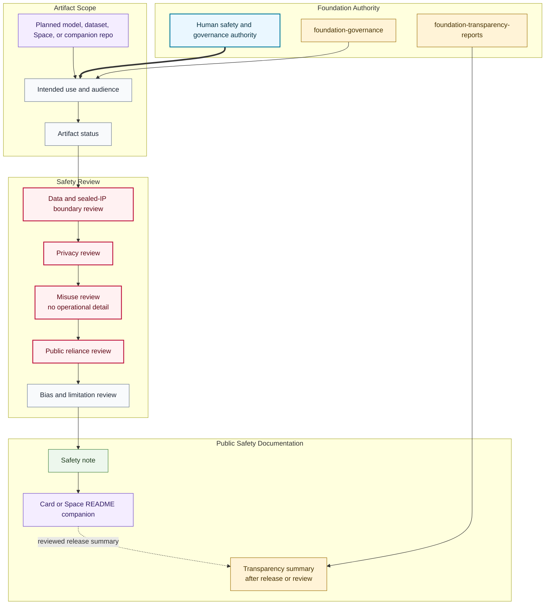

# Safety Review Workflow Map

## Purpose

This graph shows how civic AI safety notes move from artifact scope through boundary, privacy, misuse, reliance, governance, and publication review.

## Mermaid Diagram

## Interpretation Notes

- Safety review begins while artifacts are planned, before public release claims.
- Boundary and privacy review happen before misuse, reliance, and limitation language is published.
- Transparency reporting is downstream from reviewed safety documentation.

## Boundary Notes

- Private evaluations, sealed methods, sensitive abuse details, production prompts, and private telemetry stay outside this public repository.
- Safety notes can discuss risk categories without publishing operational misuse details.
- Cards and Space READMEs need safety companions before public reliance is invited.

## Follow-Up Actions

- Link model, dataset, and Space card repositories after they are scaffolded.
- Add artifact-specific safety notes only after human review.
- Update this map when release status gates change.
