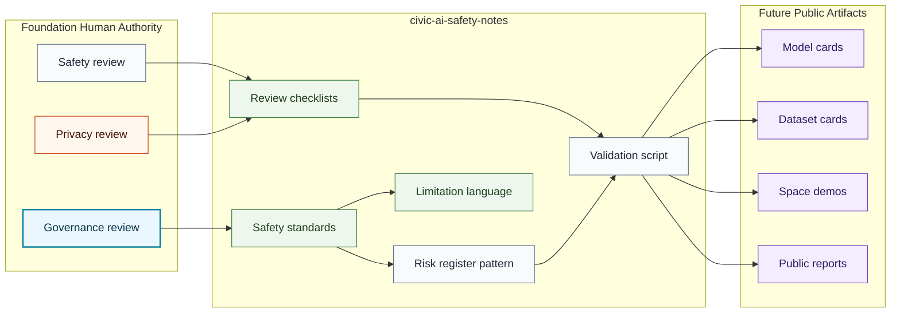

# Safety System Map

## Purpose

This graph shows how safety standards, artifact checklists, risk review, and human authority connect without claiming live releases.

## Mermaid Diagram

## Interpretation Notes

- The repository supplies standards and checklists.
- Human authority remains upstream of any release or claim.
- Validation checks structure and public-safety language only.

## Boundary Notes

- Private review records, evaluations, data, and sealed IP stay outside this repository.
- Release nodes represent future reviewed artifacts, not live deployments.
- Hugging Face is a release surface only.

## Follow-Up Actions

- Link reviewed artifacts only after they exist.
- Expand risk categories as artifact classes mature.
- Re-run validation after any graph or checklist change.
