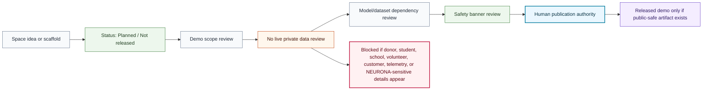

# Space Safety Review Flow

## Purpose

This graph shows the review flow before a Hugging Face Space or demo can move beyond planned/scaffolded status.

## Mermaid Diagram

## Interpretation Notes

- Planned Space scaffolds must remain clear about not being live demos.
- Safety banners are required before any interactive public demo.
- Live model or dataset claims require separately reviewed public artifacts.

## Boundary Notes

- Spaces must not collect or process donor data, student data, school private data, volunteer data, customer data, private telemetry, or private operations.
- Security-sensitive NEURONA operational details are blocked.

## Follow-Up Actions

- Reuse this flow in `foundation-spaces`.
- Add demo-specific checklists before enabling runnable code.
